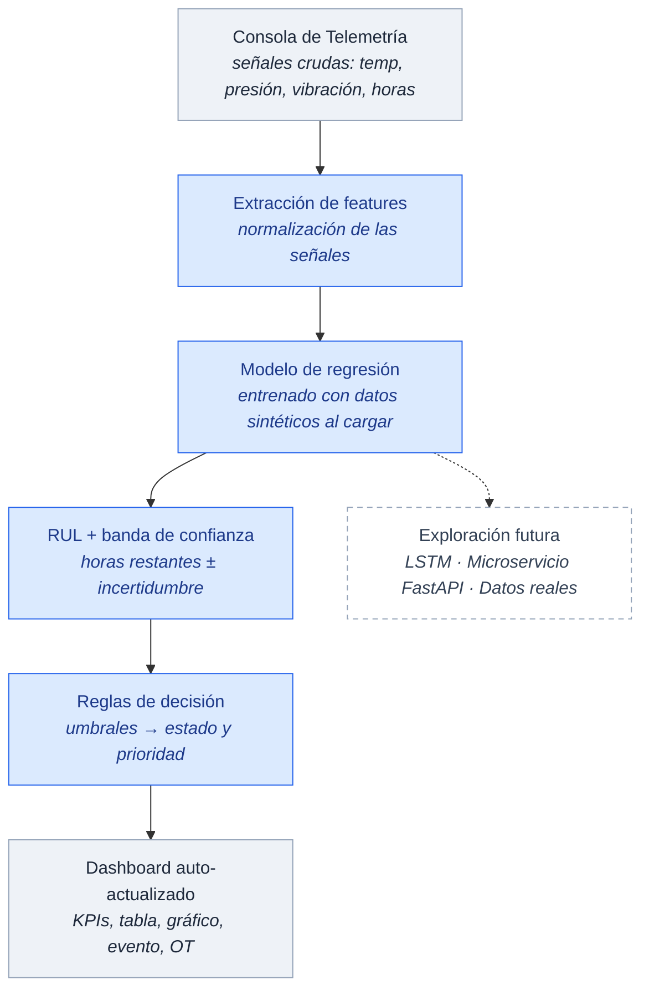

# SATELLITE-TRACK — Arquitectura del demo de ML y propuesta para la tesis

> Documento de acompañamiento del prototipo `SATELLITE-TRACK.html`.
> Objetivo de la tesis: **automatización del proceso** de mantenimiento predictivo de flota
> mediante un dashboard de control. El componente de Machine Learning es un **demo básico de
> exploración futura**, no el núcleo de la contribución.

---

## 1. Resumen

`SATELLITE-TRACK` es una maqueta funcional (Single Page Application en HTML/CSS/JS vanilla,
un solo archivo autocontenido) que demuestra el flujo automatizado de mantenimiento predictivo
para el transporte de personal minero: telemetría → detección → predicción → orquestación de
taller/almacén → generación automática de Orden de Trabajo (OT).

Sobre esa maqueta se incorporó un **modelo de ML básico que corre en el navegador** para ilustrar,
de forma tangible, qué aporta la inteligencia predictiva al proceso: en lugar de que un operador
tipee manualmente la vida útil restante (RUL) de cada unidad, el modelo la **infiere automáticamente**
a partir de señales crudas de sensores.

---

## 2. Diagrama de arquitectura preliminar

Imagen lista para el anexo: `arquitectura-demo-ml.svg`.

Versión editable en Mermaid (renderiza en GitHub / editores Markdown):

**Leyenda:** azul = componentes nuevos del demo (corren en el navegador); gris = maqueta existente;
recuadro punteado = exploración futura fuera del alcance del prototipo.

---

## 3. Descripción de componentes

| Componente | Rol | Estado |
|---|---|---|
| Consola de Telemetría | Captura de señales crudas de sensores por unidad | Existente (ampliado) |
| Extracción de features | Normalización (z-score) de las señales de entrada | **Nuevo (ML)** |
| Modelo de regresión | Regresión lineal múltiple entrenada por mínimos cuadrados al cargar la página, sobre ~220 muestras sintéticas de degradación | **Nuevo (ML)** |
| RUL + banda de confianza | Salida: horas de vida útil restante ± incertidumbre + % de confianza | **Nuevo (ML)** |
| Reglas de decisión | Umbrales que derivan estado (CRÍTICO/ALERTA/ESTABLE) y prioridad (P1/P2/P3) | **Nuevo (ML)** |
| Dashboard | KPIs, tabla de flota, gráfico RUL, feed de eventos, generación de OT | Existente |
| Exploración futura | LSTM sobre secuencias reales, servido por microservicio | Trabajo futuro |

### Detalle técnico del modelo (para el marco teórico / anexos)

- **Algoritmo:** regresión lineal múltiple, `RUL = β₀ + Σ βᵢ·xᵢ`, resuelta por ecuaciones normales
  `(ZᵀZ)β = Zᵀy` con eliminación de Gauss-Jordan y pivoteo parcial.
- **Variables de entrada (features):** temperatura del motor (°C), presión de aceite (bar),
  vibración (mm/s), horas de operación (miles de km), número de códigos de error activos.
- **Preprocesamiento:** estandarización z-score de cada feature (media y desviación calculadas en el entrenamiento).
- **Datos:** ~220 muestras **sintéticas** generadas con una relación de degradación conocida más ruido.
- **Salida:** RUL en horas (acotado 2–120), banda de incertidumbre `± 1.96·RMSE`, y una confianza
  derivada del ancho relativo de esa banda.
- **Métrica de ajuste:** RMSE sobre el conjunto de entrenamiento (≈10 h), mostrado en la interfaz.
- **Ejecución:** 100 % en el navegador (JavaScript puro, sin librerías, sin backend, sin build).

---

## 4. Cambios propuestos para incluir en la tesis

Textos y ubicaciones sugeridas. Adaptar a la estructura de capítulos de tu universidad.

### 4.1 En "Alcance y limitaciones"

> El sistema desarrollado automatiza el proceso de monitoreo y despacho de mantenimiento
> predictivo mediante un tablero de control. Se incorpora, de manera complementaria, un módulo
> exploratorio de Machine Learning que estima la vida útil restante (RUL) de cada unidad a partir
> de señales de sensores. Dicho módulo constituye una **prueba de concepto** entrenada sobre datos
> sintéticos; su objetivo es demostrar la viabilidad de la predicción automática, no operar como
> sistema productivo certificado.

### 4.2 En "Arquitectura de la solución"

Insertar el diagrama (`arquitectura-demo-ml.svg`) con el pie de figura:

> Figura N. Arquitectura preliminar del módulo exploratorio de ML integrado a la maqueta de control.
> El operador ingresa señales crudas y el modelo infiere RUL, banda de confianza y prioridad, que
> alimentan el tablero de forma automática.

### 4.3 En "Trabajo futuro"

> El módulo de predicción se implementó como una regresión lineal sobre datos sintéticos para
> validar el concepto dentro del prototipo. Como línea de evolución se propone: (1) sustituir la
> regresión por una red **LSTM** capaz de modelar la degradación como secuencia temporal de sensores;
> (2) entrenar con **datos reales** de la flota (telemetría histórica y registros de fallas);
> (3) exponer el modelo mediante un **microservicio** (p. ej. FastAPI) desacoplado del tablero; y
> (4) incorporar **cuantificación de incertidumbre** calibrada para acompañar cada predicción con un
> intervalo confiable.

### 4.4 Justificación del enfoque (para la defensa)

- El foco de la tesis es la **automatización del proceso**; el ML entra como habilitador visible, no
  como el objeto principal de investigación.
- Usar datos sintéticos y un modelo simple es una decisión **deliberada y honesta**: permite un demo
  reproducible de archivo único, sin infraestructura, apropiado para una prueba de viabilidad.
- El diseño ya deja el "gancho" arquitectónico para la evolución (el nodo punteado del diagrama),
  lo que muestra dominio del techo tecnológico sin sobre-prometer.

---

## 5. Limitaciones declaradas

- El modelo se entrena con **datos sintéticos**; no representa el comportamiento real de la flota.
- La regresión lineal no captura dinámicas temporales (para eso se propone LSTM a futuro).
- La "confianza" es una heurística basada en el error de entrenamiento, no una probabilidad calibrada.
- Optimizado para escritorio (1280px+); no responsive.

---

## 6. Archivos del entregable

| Archivo | Descripción |
|---|---|
| `SATELLITE-TRACK.html` | Aplicación completa autocontenida (maqueta + onboarding + modelo ML) |
| `arquitectura-demo-ml.svg` | Diagrama de arquitectura para el anexo de la tesis |
| `ARQUITECTURA-Y-PROPUESTA-TESIS.md` | Este documento |
| `README.txt` | Instrucciones para levantar la app y registro de cambios |
| `SATELLITE-TRACK-context.md` | Contexto original del prototipo (spec de UI) |
